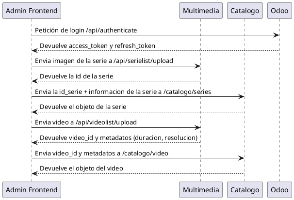

# Inicio

## Proposito
El proposito de la aplicacion es crear una plataforma de streaming, que gestione usuarios, suscriptores y administradores. Que proporcionará un listado de series y videos.

## Componentes del Sistema
La plataforma Justflix consiste en los siguientes **componentes principales**, todos orquestados por Justflix_ENV:

### Servicios Backend

| Servicio     | Tecnología             | Puerto | Propósito                                        |
|-------------|-----------------------|--------|-------------------------------------------------|
| catalogo    | Spring Boot + Java     | 8090   | Gestión del catálogo de contenido y metadatos  |
| ts-multimedia | Node.js/TypeScript    | 8080   | Streaming de medios y entrega de contenido    |
| odoo        | Python (Odoo ERP)      | 8069   | Gestión de suscripciones y autenticación       |
| nginx       | Nginx                  | 80, 443 | Proxy inverso con terminación SSL             |

### Capa de Datos

| Base de Datos  | Tipo           | Puerto | Usado por        |
|----------------|----------------|--------|-----------------|
| mysql_db       | MySQL 8.0      | 3308   | Servicio catalogo |
| postgres_db    | PostgreSQL 14  | 5432   | Servicio Odoo    |

### Aplicaciones Cliente

| Aplicación          | Tecnología | Propósito                               | Repositorio          |
|--------------------|-----------|----------------------------------------|--------------------|
| Admin Frontend     | Vue.js    | Interfaz de gestión de contenido       | Justflix_Admin      |
| Reproductor        | Flutter   | Aplicación de streaming para usuarios finales | Justflix_Reproductor |

## Flujos Generales

### Administrador

